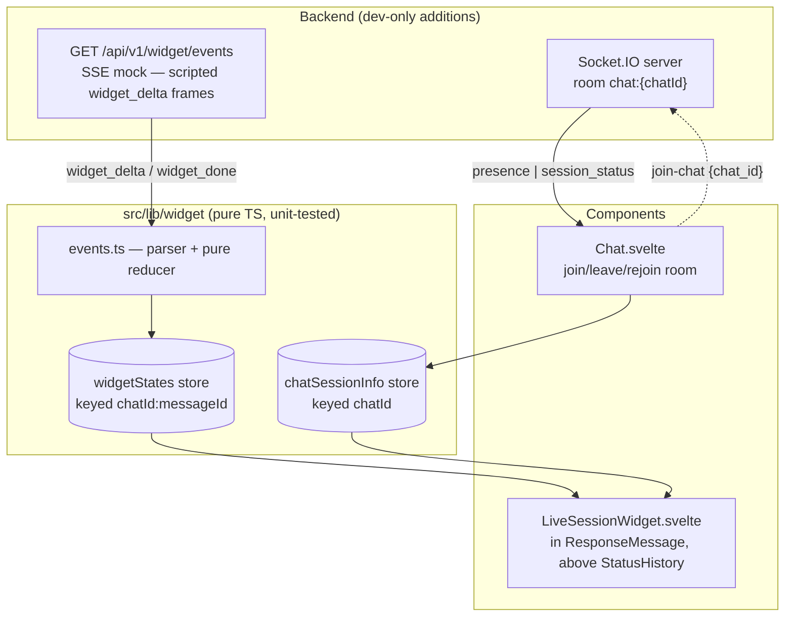

# NOTES — Live Session Widget

> Status: implemented. `npm run test:frontend` — 16 tests green.

## Run

```sh
# frontend
cp -RPp .env.example .env && npm install && npm run dev
# backend (Python 3.11 venv, requirements.txt, WEBUI_SECRET_KEY in .env)
sh backend/dev.sh          # ENV=dev registers the widget router — check /docs
```

Use a working model provider (Ollama or any OpenAI-compatible key) and a **single model** — with multi-model responses, each per-message stream emits chat-level `session_status`, so the first to finish flips the chat to `complete` early (accepted limitation).

## Architecture



- **The component owns one SSE request.** Destroying it (navigation, chat switch) aborts the request; non-terminal state is deleted, completed snapshots stay in the store and re-render on navigate-back.
- **Events pass through a pure parser and reducer** (`(state, event) → state`, no I/O, no clock) into state keyed `chatId:messageId` — duplicates are idempotent upserts, malformed frames are dropped, deltas after a terminal status are ignored.
- **Chat.svelte owns Socket.IO room membership** — join on chat open, leave on switch, rejoin on reconnect. Presence = session count (tabs/devices), the meaningful number for a single-user chat.
- **Continue-response** (Open WebUI reuses the messageId and flips `done` back to false) is the one edge-trigger: observed `true → false` clears state and restarts once. Regenerate mints a new messageId and gets a fresh key for free. `complete`/`error` never auto-restart.
- **Widget mounts only for persisted chats.** A brand-new chat has no id until the backend assigns one, and a temporary chat is given `local:{socket.id}` and never persists; streaming against either would 403 with no recovery. The render gate rejects both, so the widget appears a beat after the first send on a new chat and never appears in a temporary one (deliberate cut).

## Real vs. mocked

| Real, live                                 | Scripted (mock SSE)                 |
| ------------------------------------------ | ----------------------------------- |
| Elapsed time, ≈ tokens (answer length ÷ 4) | Step timeline (RAG retrieval trace) |
| WS status (`socketStatus` store)           | Sources count, confidence metric    |
| Active sessions (room membership)          |                                     |
| Generation status (`done`/`error` + SSE)   |                                     |

The mock deliberately emits one duplicate and one malformed frame mid-stream — resilience is visible in the demo, not just in tests. `?scenario=error` gives a deterministic error path.

The endpoint's four gates (401 without a token, 403 for a chat the caller does not own, 422 for an unknown scenario, 200 `text/event-stream` otherwise) and both stream scripts were exercised directly against `StreamingResponse`, including a simulated client disconnect. The router is absent from the app entirely when `ENV != 'dev'`.

## Tradeoffs

1. **SSE side-channel is the assignment's shape, not production's.** In production, the generation pipeline itself would emit widget events over the existing `get_event_emitter` → Socket.IO path (as `statusHistory` does), persisted with the message — late joiners get snapshot + live tail. The pure reducer is the migration hedge: only the parser layer would change.
2. **Component-owned cancellation over a shared stream registry.** An earlier design let streams outlive components (nicer navigate-back mid-stream), then needed epoch guards against finalizer races. Reversed after review: destroy-aborts is legible and removes the hardest code; cost is the ~7s mock replaying if you leave and return mid-stream.
3. **Presence is real but node-local.** `chat:{id}` rooms with `is_chat_owner` checks on both the socket join and the SSE endpoint; counting via room membership (browsers never say goodbye — disconnect handling keeps it honest). Multi-node presence needs shared membership state — out of scope per the brief.
4. **No real token counting.** That would mean writing state inside the per-chunk completion handler — the app's hottest path — for a demo metric. `content.length / 4` is live, honest ("≈"), and touches nothing.
5. **The `session_status: complete` emit is shielded.** Real answers usually finish before the ~7s mock, so the component aborts and the endpoint's cleanup runs via client cancellation rather than natural completion. Starlette streams inside an anyio cancel scope, so a plain `await` in the generator's `finally` is re-cancelled immediately and the emit never lands — every other viewer keeps a stale "streaming" badge forever. Verified against real `StreamingResponse` with a simulated `http.disconnect`, then fixed with `anyio.move_on_after(2, shield=True)`: the shield lets the emit complete, the timeout stops a wedged emit from holding the connection open. Concurrent streams on one chat are last-writer-wins (accepted).

## Tests

Built test-first: parser/reducer and store suites written before their implementations, then used as the regression gate for backend and integration phases. `npm run test:frontend` (vitest, `environment: 'node'`, no new deps).

- `events.test.ts` — frames split across chunk boundaries, malformed JSON, duplicate-step idempotence, step/metric upserts, done/error + post-terminal deltas ignored.
- `store.test.ts` — happy stream reaches `complete` (malformed frame mid-stream, no corruption); abort stops all further writes and `clearWidgetIfActive` drops the partial; an already-aborted signal never even fetches; wrong-messageId events ignored; non-ok responses become `error`; `reset` restarts a finished key.

Both suites were mutation-tested: deliberately breaking the terminal guard, the step dedup, the status validation, the messageId filter and the clear-if-active guard each turned a suite red, so the assertions are load-bearing rather than incidental.

Svelte lifecycle (continue/regenerate/destroy) is deliberately outside vitest (no jsdom added) — covered manually below.

## Manual verification

1. curl the endpoint (Bearer, `-N`): full script with dupe + malformed; `&scenario=error` → `widget_error`; no token → 401; unowned chat_id → 403.
2. Send a message → widget above the streaming answer: starting → streaming, steps advance, metrics tick, progress rail indeterminate then snaps full on complete; no glitch at the dupe/malformed frames.
3. Second tab, same chat → both show 2 sessions; close → 1. Session badge flips streaming → complete.
4. Kill backend mid-generation → "reconnecting" (stays — client retries forever); restart → rejoins room, count restored.
5. Regenerate → fresh widget, siblings intact. Continue → resets and restarts on the same id. Stop → terminal, no zombie updates.
6. Navigate away mid-stream and back → fresh start (mock replay, accepted); back to a completed message → snapshot renders.
7. A11y: with reduced motion enabled, indicators go static (opacity-only entrance); VoiceOver announces each status transition once — the elapsed/token tickers stay out of the live region and silent.
8. `npm run test:frontend` green.

## Production hardening

- Emit widget events from the real pipeline (single source of truth), persist with the message, fan out via rooms.
- Shared (Redis) room membership for multi-node presence.
- Shared runtime-validated schema for the event contracts instead of convention.
- Rate-limit the SSE endpoint if it ever leaves dev-only registration.

## AI tools

I used Claude Code for codebase exploration, design iteration, and implementation, with the architecture reviewed and stress-tested before any code was written. The design decisions are mine: real SSE endpoint and Socket.IO room over mocks, component-owned cancellation, pure parser/reducer layering, session-count presence semantics, and the cut list above. I can walk through and defend every part of the implementation.

One upstream fix included (own commit): `+layout.svelte` registered Socket.IO reconnection events on the Socket instead of the Manager, so they never fired; this feature's connection indicator depends on them.
