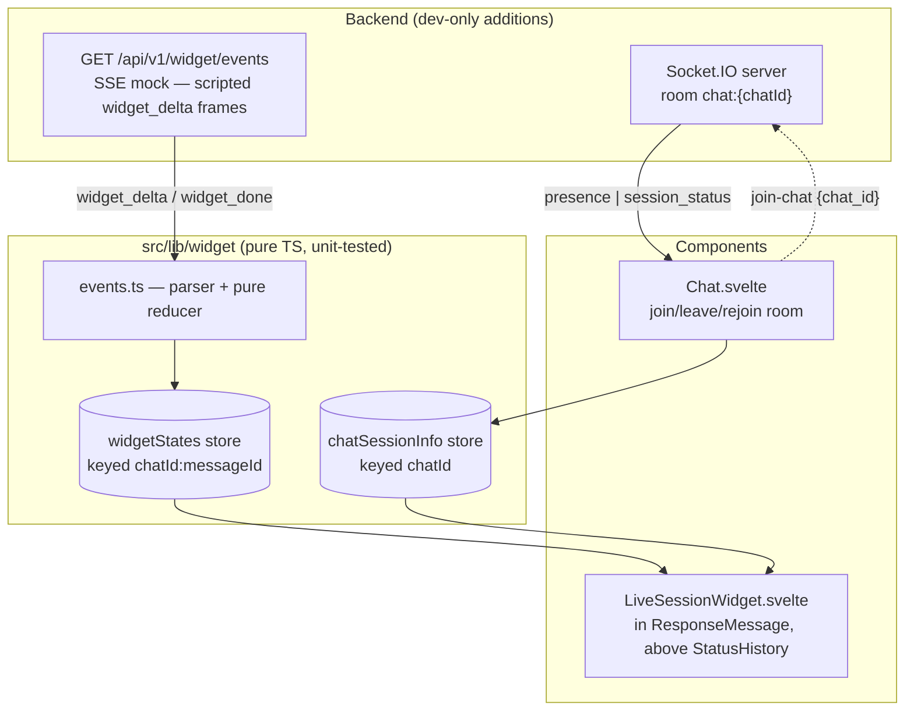

# NOTES — Live Session Widget

> Status: implemented and verified in the browser. `npm run test:frontend` — 36 tests green.

## Run

```sh
# frontend
cp -RPp .env.example .env && npm install && npm run dev
# backend (Python 3.11 venv, requirements.txt, WEBUI_SECRET_KEY in .env)
sh backend/dev.sh          # ENV=dev registers the widget router — check /docs
```

Use a working model provider (Ollama or any OpenAI-compatible key) and a **single model** — with multi-model responses, each per-message stream emits chat-level `session_status`, so the first to finish flips the chat to `complete` early (accepted limitation).

## Architecture



- **The component owns one SSE request.** Destroying it (navigation, chat switch) aborts the request; non-terminal state is deleted, completed snapshots stay in the store and re-render on navigate-back.
- **Events pass through a pure parser and reducer** (`(state, event) → state`, no I/O, no clock) into state keyed `chatId:messageId` — duplicates are idempotent upserts, malformed frames are dropped, deltas after a terminal status are ignored.
- **Chat.svelte owns Socket.IO room membership** — join on chat open, leave on switch, rejoin on reconnect. Presence = session count (tabs/devices), the meaningful number for a single-user chat.
- **Continue-response** (Open WebUI reuses the messageId and flips `done` back to false) is the one edge-trigger: observed `true → false` clears state and restarts once. Regenerate mints a new messageId and gets a fresh key for free. `complete`/`error` never auto-restart.
- **The scripted stream and the answer are two different clocks**, and the widget never conflates them. `widget_done` ends the ~7s retrieval trace; the answer routinely generates for much longer. Only the message's own `done` may show **Complete** or fill the rail — in between, the widget says "Retrieval complete · generating answer…" and keeps the elapsed timer running. Browser testing caught the earlier version claiming **Complete** ~30s early, which is exactly the lie a progress indicator exists to avoid. The state carries both timestamps for the same reason: `finishedAt` (stream) and `endedAt` (generation, and what elapsed measures).
- **Finishing is level-triggered, not edge-triggered.** Restarting needs an edge — continue-response is only visible as `done` going true → false. Finishing does not: the component asks "generation over and this session unstamped?" on every update, and `finalizeWidget` is write-once so re-running is free. The edge-triggered version missed the transition in the browser and stranded elapsed at the mock's ~6s finish, snapping a 1:43 timer backwards. Level-triggering cannot be defeated by a remount or a coalesced update.
- **It blends in rather than announcing itself.** No card, no border — one quiet `text-xs` line in the StatusHistory idiom: the current step shimmering with stats parenthesized after it (`Searching research repositories… (2m 21s · ~ 1.2k tokens)`), a hairline indeterminate rail beneath. The step checklist is expanded while streaming, because watching it fill in is the point; on completion the whole thing auto-collapses to one footer (`Complete · 7 sources · 92% confidence (22s · ~ 5.1k tokens)`) that a chevron re-expands. Healthy state is silent: connection appears only when reconnecting or offline, session count only above one.
- **Widget mounts only for persisted chats.** A brand-new chat has no id until the backend assigns one, and a temporary chat is given `local:{socket.id}` and never persists; streaming against either would 403 with no recovery. The render gate rejects both, so the widget appears a beat after the first send on a new chat and never appears in a temporary one (deliberate cut).

## Real vs. mocked

| Real, live                                   | Scripted (mock SSE)                 |
| -------------------------------------------- | ----------------------------------- |
| Elapsed time, ≈ tokens (rendered answer ÷ 4) | Step timeline (RAG retrieval trace) |
| WS status (`socketStatus` store)             | Sources count, confidence metric    |
| Active sessions (room membership)            |                                     |
| Generation status (`done`/`error` + SSE)     |                                     |

The mock deliberately emits one duplicate and one malformed frame mid-stream — resilience is visible in the demo, not just in tests. `?scenario=error` gives a deterministic error path.

The endpoint's four gates (401 without a token, 403 for a chat the caller does not own, 422 for an unknown scenario, 200 `text/event-stream` otherwise) and both stream scripts were exercised directly against `StreamingResponse`, including a simulated client disconnect. The router is absent from the app entirely when `ENV != 'dev'`.

## Tradeoffs

1. **SSE side-channel is the assignment's shape, not production's.** In production, the generation pipeline itself would emit widget events over the existing `get_event_emitter` → Socket.IO path (as `statusHistory` does), persisted with the message — late joiners get snapshot + live tail. The pure reducer is the migration hedge: only the parser layer would change.
2. **Component-owned cancellation over a shared stream registry.** An earlier design let streams outlive components (nicer navigate-back mid-stream), then needed epoch guards against finalizer races. Reversed after review: destroy-aborts is legible and removes the hardest code; cost is the ~7s mock replaying if you leave and return mid-stream.
3. **Presence is real but node-local.** `chat:{id}` rooms with `is_chat_owner` checks on both the socket join and the SSE endpoint; counting via room membership (browsers never say goodbye — disconnect handling keeps it honest). Multi-node presence needs shared membership state — out of scope per the brief.
4. **No real token counting.** That would mean writing state inside the per-chunk completion handler — the app's hottest path — for a demo metric. Dividing the rendered answer's length by 4 is live, honest ("≈"), and touches nothing. It reads `visibleResponseContent`, not `message.content`, because structured-output responses keep their text in `message.output` — reading the raw field showed `≈ tokens 0` next to a full answer.
5. **The `session_status: complete` emit is shielded.** Real answers usually finish before the ~7s mock, so the component aborts and the endpoint's cleanup runs via client cancellation rather than natural completion. Starlette streams inside an anyio cancel scope, so a plain `await` in the generator's `finally` is re-cancelled immediately and the emit never lands — every other viewer keeps a stale "streaming" badge forever. Verified against real `StreamingResponse` with a simulated `http.disconnect`, then fixed with `anyio.move_on_after(2, shield=True)`: the shield lets the emit complete, the timeout stops a wedged emit from holding the connection open. Concurrent streams on one chat are last-writer-wins (accepted).

## Tests

Built test-first: parser/reducer and store suites written before their implementations, then used as the regression gate for backend and integration phases. `npm run test:frontend` (vitest, `environment: 'node'`, no new deps).

- `events.test.ts` — frames split across chunk boundaries, malformed JSON, duplicate-step idempotence, step/metric upserts, done/error + post-terminal deltas ignored; plus the two derivations that decide what the user sees: displayed status (a finished stream is not a finished answer) and elapsed time (measured against the generation, never the stream).
- `store.test.ts` — happy stream reaches `complete` (malformed frame mid-stream, no corruption); abort stops all further writes and `clearWidgetIfActive` drops the partial; an already-aborted signal never even fetches; wrong-messageId events ignored; non-ok responses become `error`; `reset` restarts a finished key and clears `endedAt`; finalizing stamps `endedAt` without touching the stream's own `finishedAt`, is write-once under repeated calls, and never rewrites a stream error as success.

Both suites were mutation-tested: deliberately breaking the terminal guard, the step dedup, the status validation, the messageId filter, the clear-if-active guard, and each of the two display derivations turned a suite red, so the assertions are load-bearing rather than incidental.

The display derivations earned their place there. Both shipped as inline expressions in the component, both were wrong, and both were caught by a person driving a browser rather than by the suite — a finished stream reported as a finished answer, and elapsed falling back to the stream's end and jumping backwards. Pulling them out as pure functions is what made them testable at all.

Svelte lifecycle (continue/regenerate/destroy) is deliberately outside vitest (no jsdom added) — covered manually below.

## Manual verification

1. curl the endpoint (Bearer, `-N`): full script with dupe + malformed; `&scenario=error` → `widget_error`; no token → 401; unowned chat_id → 403.
2. Send a message → widget above the streaming answer: starting → streaming, steps advance, metrics tick, no glitch at the dupe/malformed frames. When the retrieval trace ends ahead of the answer the line reads "Retrieval complete · generating answer…", the rail stays indeterminate and elapsed keeps running; the footer flips to **Complete** only when the answer itself finishes, and elapsed holds at the time it showed rather than snapping back to the mock's duration. Watch the timer for a couple of minutes — the digits should advance one second at a time without skipping.
3. Collapse and expand via the chevron: no horizontal shift, no scroll jump, no focus loss. Hovering the line shows the same content as text; keyboard and touch use the button instead.
4. Second tab, same chat → the expanded trace shows 2 sessions; close → the count disappears again (one viewer is the norm and stays silent). The "Session active" badge appears while another session's stream is open.
5. Kill backend mid-generation → "reconnecting" appears in the trace (and stays — the client retries forever); restart → rejoins room, count restored, indicator goes quiet again.
6. Regenerate → fresh widget, siblings intact. Continue → resets and restarts on the same id. Stop → terminal, no zombie updates.
7. Navigate away mid-stream and back → fresh start (mock replay, accepted); back to a completed message → snapshot renders.
8. A11y: with reduced motion enabled the shimmer and rail go static and the entrance is opacity-only; VoiceOver announces each status transition once — the elapsed/token tickers stay out of the live region and silent, and the token count is heard as "approximately", never "tilde". Check the shimmer in both light and dark themes, since on the collapsed line it _is_ the working indicator.
9. `npm run test:frontend` green.

## Production hardening

- Emit widget events from the real pipeline (single source of truth), persist with the message, fan out via rooms.
- Shared (Redis) room membership for multi-node presence.
- Shared runtime-validated schema for the event contracts instead of convention.
- Rate-limit the SSE endpoint if it ever leaves dev-only registration.

## AI tools

I ran a deliberate multi-model workflow, with each model in a distinct role. The plan was authored in Claude Code with **Fable 5**: read-only exploration agents mapped the codebase first, then the architecture went through five review rounds before any code was written. At every revision I had **GPT 5.6 Sol** review the plan adversarially — feedback plus explicit tradeoffs — and those rounds materially changed the design (a restart-rule that could loop forever was caught; an early stream-ownership model was reversed in favor of component-owned cancellation). Implementation was then handed to **Opus 5** against the frozen plan, executed in phases where each phase is a measurable, revertible commit gated on tests passing before the next begins. GPT 5.6 Sol also drove the browser-level manual verification via Playwright MCP tool calls — which is what caught the widget claiming **Complete** ~30s before the answer actually finished.

The design decisions are mine: real SSE endpoint and Socket.IO room over mocks, component-owned cancellation, pure parser/reducer layering, session-count presence semantics, the honest indeterminate progress rail, and the cut list above.

One upstream fix included (own commit): `+layout.svelte` registered Socket.IO reconnection events on the Socket instead of the Manager, so they never fired; this feature's connection indicator depends on them.
