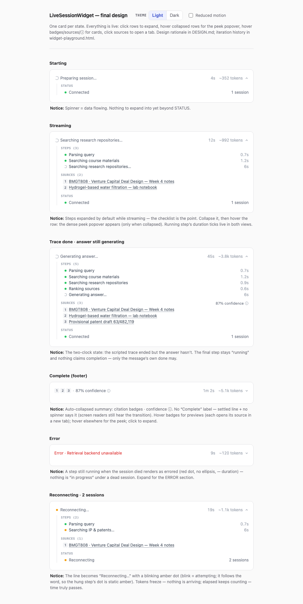
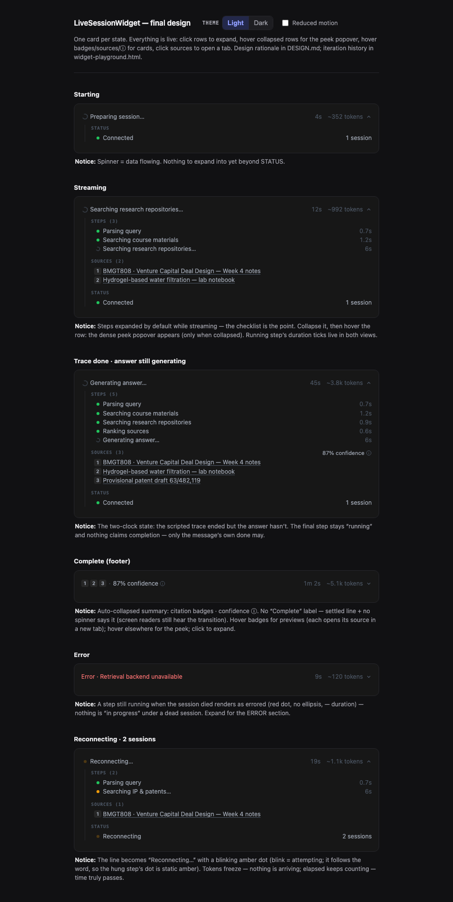
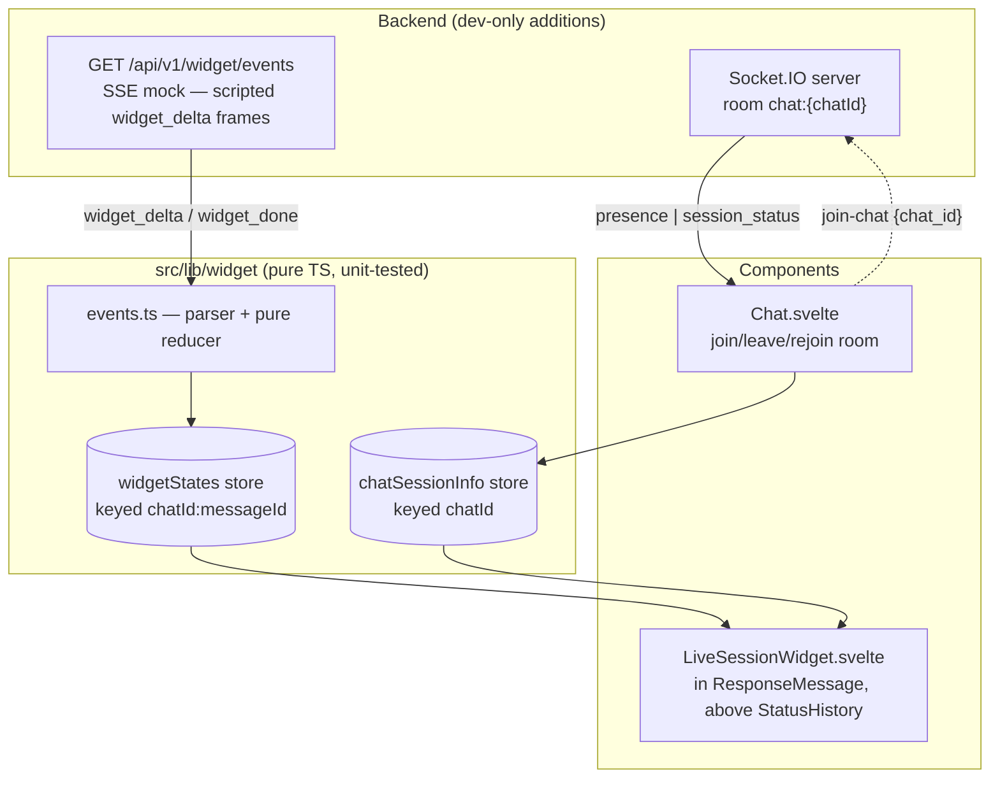

# Live Session Widget

A real-time status widget for Open WebUI. It appears with each assistant response and streams retrieval steps, sources, and live metrics while the answer generates.

> Implemented and verified in the browser. `npm run test:frontend` — 47 tests green.

## Demo

https://github.com/user-attachments/assets/cae08322-0c45-4a8d-b8cf-69499ddc0bf3

37 seconds, recorded live: a web-search question, the widget streaming steps and sources beside the real answer, then settling into its citation footer. If the player doesn't load, the video is also [here](design/demo.mp4).

<p>
  
  
</p>

More: [peek popover](design/showcase-peek-popover.png) · **[DESIGN.md](DESIGN.md)** (principles, iteration history, bugs caught in design) · `widget-showcase.html` (the final design, live — open from disk).

## Run

```sh
# frontend
cp -RPp .env.example .env && npm install && npm run dev

# backend (Python 3.11 venv, requirements.txt, WEBUI_SECRET_KEY in .env)
sh backend/dev.sh   # ENV=dev registers the widget router — check /docs
```

You need a working model provider (Ollama or any OpenAI-compatible key). Use a **single model**: with multi-model responses, the first stream to finish flips the chat-level status early (accepted limitation).

## How it works



**The component owns one SSE request.** Destroying it — navigation, chat switch, regenerate — aborts the request. Finished snapshots stay in the store, so navigating back still shows the trace.

**Events pass through a pure parser and reducer** into state keyed `chatId:messageId`. Duplicate frames are no-ops. Malformed frames are dropped. Nothing changes after a terminal state.

**Chat.svelte owns the socket room.** Join on chat open, leave on switch, rejoin after reconnect. Presence counts sessions (tabs), not users — the number that matters for a single-user chat.

**Restarting needs an edge; finishing needs a level.** Continue-response reuses the messageId and flips `done` back to false — only that transition restarts a stream, so restarts can't loop. Finishing checks "generation over and unstamped?" on every update — levels can't be missed by a remount, and `finalizeWidget` is write-once so re-runs are free. Regenerate gets a new id, so a fresh key.

**Two clocks, never conflated.** The mock stream ends (`finishedAt`) long before the answer does (`endedAt`). Only the message's own `done` can mark the widget complete, and elapsed always measures the generation. The first version claimed "Complete" ~30 seconds early — exactly the lie a status indicator exists to avoid.

**Indicators have meanings.** Spinner: data is flowing. Blinking amber: attempting, no response — and only on elements that say "Reconnecting"; a hung step shows static amber, because the step isn't retrying, the socket is. Static: settled. With reduced motion, everything is static and the "…" suffix plus the live region carry activity — the same path screen readers use.

**Sources are events, not a count.** Each carries `{n, title, url}`, so the UI cites `[1][2][3]` as real links with hover previews. The reducer stamps step start/end from each event's arrival time (passed in as an argument, keeping it pure) — that's where per-step durations come from. An error settles any step still running.

**The UI is one quiet line.** Spinner, current step, elapsed and `~tokens` right-aligned. Details expand on click (or peek on hover while collapsed); completed sessions collapse to a citation footer — `[1][2][3] · 87% confidence`. Healthy connection stays silent.

**Finished sessions survive a reload.** The terminal state is saved onto the message as `liveSession` (versioned, following the `statusHistory` precedent). Saving is explicit — mutating `history` persists nothing, so the snapshot goes through `saveMessage`, once per session, retried on failure. Hydration validates everything; on any doubt it renders no widget rather than a broken one.

**The widget mounts only for persisted chats.** New chats get it once the backend assigns a real id; temporary chats never do — streaming against a `local:` placeholder id would 403 with no recovery.

## Real vs. mocked

| Real, live                                    | Scripted (mock SSE)                  |
| --------------------------------------------- | ------------------------------------ |
| Elapsed time, ~tokens (rendered answer ÷ 4)   | Step timeline (RAG retrieval trace)  |
| WS status (`socketStatus` store)              | Sources, confidence                  |
| Active sessions (room membership)             |                                      |
| Generation status (`done`/`error` + SSE)      |                                      |

The script is **deterministic per message**: `sha256(message_id)` picks the collections, sources, and numbers. Same message replays byte-identically; different messages vary the demo. Every variant includes one duplicate frame and one malformed line, so the resilience is visible in any demo. `?scenario=error` gives a deterministic failure.

Verify determinism without the streaming machinery (`build_script` is pure):

```sh
cd backend && PYTHONPATH=$PWD ./venv/bin/python -c "from open_webui.routers.widget import build_script, _frame; a=[_frame(e,p,'m') for _,e,p in build_script('m','happy')]; b=[_frame(e,p,'m') for _,e,p in build_script('m','happy')]; assert a==b; print('deterministic', len(a), 'frames')"
```

The endpoint has four gates — 401 without a token, 403 for a chat you don't own, 422 for an unknown scenario, 200 `text/event-stream` otherwise — all exercised against `StreamingResponse`, including a simulated disconnect. When `ENV != 'dev'`, the router doesn't exist.

## Design decisions

1. **The SSE side-channel is the assignment's shape, not production's.** In production, the pipeline itself would emit widget events over the existing Socket.IO path (like `statusHistory` does), persisted with the message. The pure reducer survives that move unchanged — only the parser layer swaps.
2. **The component owns cancellation.** An earlier design shared streams across components and needed guards against finalizer races. Deleting that design was simpler than defending it. Cost: leaving mid-stream and returning replays the ~7s mock.
3. **Presence is real but single-node.** Multi-node needs shared room state — out of scope per the brief.
4. **Token count is an estimate.** Real counting would touch the app's hottest handler for a demo metric. Rendered length ÷ 4, labeled `~`. It reads the rendered content, not `message.content` — structured outputs keep their text elsewhere.
5. **Hover cards render through tippy into `document.body`.** Absolutely-positioned cards get clipped by the app's `overflow` ancestors. Content is passed as DOM elements, so Svelte escapes source titles — no sanitizer needed.
6. **The `session_status: complete` emit is shielded.** Client cancellation re-cancels a plain `await` inside the generator's `finally`, and the emit never lands — verified against a simulated disconnect, fixed with `anyio.move_on_after(2, shield=True)`. Concurrent streams on one chat are last-writer-wins (accepted).

## Tests

Built test-first: the parser/reducer and store suites predate their implementations and gated every later phase. `npm run test:frontend` — vitest, node environment, no new dependencies.

- `events.test.ts` — chunk-split frames, malformed JSON, duplicate idempotence, step timing (never re-stamped by duplicates), error-orphaned steps, sources, snapshot round-trip plus every rejection path, formatter boundaries, and both display derivations (a finished stream is not a finished answer; elapsed never measures the stream).
- `store.test.ts` — abort stops all writes, an aborted signal never fetches, wrong-messageId frames are ignored, non-ok responses become errors, reset restarts a finished key, finalize is write-once and never rewrites an error as success.

Both suites are mutation-tested: breaking each guard turns a suite red, so the assertions are load-bearing. The two display derivations are there because both shipped inline, both were wrong, and both were caught by a human in a browser — extracting them as pure functions is what made them testable.

Svelte lifecycle (continue / regenerate / destroy) is deliberately outside vitest — covered manually below, no jsdom added.

## Verify manually

1. `curl -N` the endpoint with a Bearer token: full script with the duplicate and malformed frames; `&scenario=error` ends in `widget_error`; no token → 401; unowned chat → 403.
2. Send a message. The widget streams steps with live durations and cites sources; no glitch at the hostile frames. When the trace ends before the answer, the last step stays spinning as "Generating answer…" — the footer only appears when the answer finishes, and elapsed holds rather than snapping back.
3. Collapse and expand — chevron or anywhere on the row. Collapsed + hover shows the peek popover; expanded shows nothing (nothing is hidden). Source badges and titles open in a new tab and preview on hover, even near the sidebar and viewport edges.
4. Open the chat in a second tab: both show 2 sessions. Close it: the count disappears (one session stays silent).
5. Kill the backend mid-generation: "Reconnecting" with a blinking amber dot, tokens freeze, elapsed keeps counting. Restart: it rejoins the room and goes quiet.
6. Regenerate → fresh widget, siblings intact. Continue → resets and restarts on the same id. Stop → terminal, no zombie updates.
7. Navigate away mid-stream and back → fresh start (mock replays, accepted). Back to a completed message → the snapshot renders.
8. Reload after completion → the trace is still there, no "Starting" flash. Hand-edit `liveSession` in the stored JSON to garbage → the widget is simply absent.
9. Reduced motion → all indicators static, opacity-only entrance. VoiceOver announces each status transition once; the tickers stay silent; the token count is heard as "approximately".
10. `npm run test:frontend` — green.

## Before production

- Emit widget events from the real pipeline (single source of truth), persist with the message, fan out via rooms.
- Shared (Redis) room membership for multi-node presence.
- Runtime-validated shared schema for the event contracts.
- Rate-limit the SSE endpoint if it ever leaves dev-only registration.

## AI tools

I ran a multi-model workflow with distinct roles: Fable 5 (Claude Code) for codebase exploration and plan authoring across five adversarial review rounds, GPT 5.6 Sol reviewing each revision and later driving browser verification via Playwright MCP, and Opus 5 implementing the frozen plan in phased, test-gated commits. The architecture and tradeoffs are my decisions — component-owned cancellation, pure parser/reducer layering, real Socket.IO presence around a dev-only SSE source, and the cut list above. I reviewed every change, ran the tests and manual scenarios, and can explain the complete implementation.

One upstream fix included (own commit): `+layout.svelte` registered Socket.IO reconnection events on the Socket instead of the Manager, so they never fired. This feature's connection indicator depends on them.
