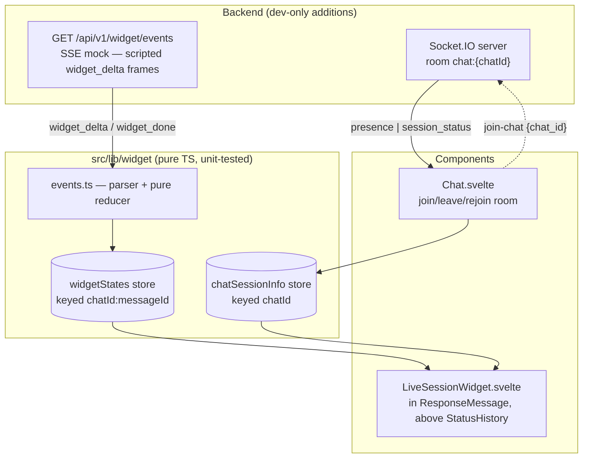

# NOTES — Live Session Widget

> Status: implemented and verified in the browser. `npm run test:frontend` — 47 tests green.

## Run

```sh
# frontend
cp -RPp .env.example .env && npm install && npm run dev
# backend (Python 3.11 venv, requirements.txt, WEBUI_SECRET_KEY in .env)
sh backend/dev.sh          # ENV=dev registers the widget router — check /docs
```

Use a working model provider (Ollama or any OpenAI-compatible key) and a **single model** — with multi-model responses, each per-message stream emits chat-level `session_status`, so the first to finish flips the chat to `complete` early (accepted limitation).

**Design artifacts** (repo root, self-contained — kept deliberately as process evidence): `design/` holds screenshots of every state ([light](design/showcase-light.png) · [dark](design/showcase-dark.png) · [peek popover](design/showcase-peek-popover.png)) so nothing needs to run to see what was built; `widget-showcase.html` renders the final design live, one annotated card per state; `widget-playground.html` is the iteration sandbox the design went through; `DESIGN.md` records the principles, systems, and the bugs the design process caught before they shipped.

## Architecture



- **The component owns one SSE request.** Destroying it (navigation, chat switch) aborts the request; non-terminal state is deleted, completed snapshots stay in the store and re-render on navigate-back.
- **Events pass through a pure parser and reducer** (`(state, event) → state`, no I/O, no clock) into state keyed `chatId:messageId` — duplicates are idempotent upserts, malformed frames are dropped, deltas after a terminal status are ignored.
- **Chat.svelte owns Socket.IO room membership** — join on chat open, leave on switch, rejoin on reconnect. Presence = session count (tabs/devices), the meaningful number for a single-user chat.
- **Continue-response** (Open WebUI reuses the messageId and flips `done` back to false) is the one edge-trigger: observed `true → false` clears state and restarts once. Regenerate mints a new messageId and gets a fresh key for free. `complete`/`error` never auto-restart.
- **The scripted stream and the answer are two different clocks**, and the widget never conflates them. `widget_done` ends the ~7s retrieval trace; the answer routinely generates for much longer. Only the message's own `done` may settle the widget — in between, the final step renders as still running ("Generating answer…") and the elapsed timer keeps counting. Browser testing caught the earlier version claiming completion ~30s early, which is exactly the lie a status indicator exists to avoid. The state carries both timestamps for the same reason: `finishedAt` (stream) and `endedAt` (generation, and what elapsed measures).
- **Finishing is level-triggered, not edge-triggered.** Restarting needs an edge — continue-response is only visible as `done` going true → false. Finishing does not: the component asks "generation over and this session unstamped?" on every update, and `finalizeWidget` is write-once so re-running is free. The edge-triggered version missed the transition in the browser and stranded elapsed at the mock's ~6s finish, snapping a 1:43 timer backwards. Level-triggering cannot be defeated by a remount or a coalesced update.
- **Indicators mean specific things.** A spinner is data flowing, a blinking amber dot is attempting-with-no-response, static is settled — and the blink follows the word: the primary marker and the STATUS dot blink while they read "Reconnecting", but a hung step goes static amber, because the step is not retrying, the connection is. Under reduced motion all of it stops and the trailing "…" plus the live region carry activity, which is the signal path screen readers were already using.
- **Sources are first-class, not a count.** A `source` event carries `{n, title, url}`, so the footer can cite `[1][2][3]` as real links and the expanded view can list them with previews. The old `sources` count metric stays for backward compatibility.
- **Steps are timed by the reducer, not the component.** It takes the event's arrival time as an argument instead of reading a clock, so it stays pure while recording when each step started and stopped. A repeated frame re-stamps neither — the mock's deliberate duplicate would otherwise stretch the duration it reports. An error settles any step still running, since nothing is in progress under a dead session.
- **It blends in rather than announcing itself.** No card, no border — one quiet line: a spinner beside the current step (`Searching research repositories…`), elapsed and `~tokens` right-aligned, a chevron. Clicking anywhere on the row toggles the details; hovering the collapsed row peeks them in a dense popover. The step checklist (with per-step durations) is expanded while streaming, because watching it fill in is the point; on completion everything auto-collapses to a citation footer (`[1][2][3] · 87% confidence`) — no "Complete" label; a settled line with no spinner says it, and the live region still announces it. Healthy state is silent: connection appears only when reconnecting or offline, session count only above one.
- **Finished sessions survive a reload.** The terminal state is snapshotted onto the message as `liveSession` — schemaless additive field, following the `statusHistory`/`usage` precedent — and versioned, because stored data outlives the code that wrote it. Writing is explicit: nested mutation of `history.messages` schedules no save, so the component hands the snapshot up to `saveMessage`, once per session and keyed on `endedAt`, marking success only after the save resolves so a failure retries rather than being swallowed. Reading is defensive in the same spirit as the SSE parser: `hydrateWidgetState` accepts only version 1, only terminal statuses, and only finite, correctly ordered timestamps. Anything else yields no widget at all, which beats a widget stranded on "Starting".
- **Widget mounts only for persisted chats.** A brand-new chat has no id until the backend assigns one, and a temporary chat is given `local:{socket.id}` and never persists; streaming against either would 403 with no recovery. The render gate rejects both, so the widget appears a beat after the first send on a new chat and never appears in a temporary one (deliberate cut).

## Real vs. mocked

| Real, live                                   | Scripted (mock SSE)                 |
| -------------------------------------------- | ----------------------------------- |
| Elapsed time, ≈ tokens (rendered answer ÷ 4) | Step timeline (RAG retrieval trace) |
| WS status (`socketStatus` store)             | Sources count, confidence metric    |
| Active sessions (room membership)            |                                     |
| Generation status (`done`/`error` + SSE)     |                                     |

The script is **deterministic per message (seeded)**: `sha256(message_id)` picks which collections get searched and derives the source counts and confidence, so the same message always replays byte-identically while different messages give a varied demo. Randomising would have cost the brief's deterministic mock endpoint; seeding buys the variety without it. Every variant keeps one duplicate frame and one malformed raw line — the resilience the widget absorbs has to be visible in any demo, not just a lucky one. `?scenario=error` gives a deterministic error path.

The script builder is a pure `build_script(message_id, scenario)` with no I/O and no sleeps, so determinism is assertable without the streaming machinery (vitest cannot see this file):

```sh
cd backend && PYTHONPATH=$PWD ./venv/bin/python -c "from open_webui.routers.widget import build_script, _frame; a=[_frame(e,p,'m') for _,e,p in build_script('m','happy')]; b=[_frame(e,p,'m') for _,e,p in build_script('m','happy')]; assert a==b; print('deterministic', len(a), 'frames')"
```

The endpoint's four gates (401 without a token, 403 for a chat the caller does not own, 422 for an unknown scenario, 200 `text/event-stream` otherwise) and both stream scripts were exercised directly against `StreamingResponse`, including a simulated client disconnect. The router is absent from the app entirely when `ENV != 'dev'`.

## Tradeoffs

1. **SSE side-channel is the assignment's shape, not production's.** In production, the generation pipeline itself would emit widget events over the existing `get_event_emitter` → Socket.IO path (as `statusHistory` does), persisted with the message — late joiners get snapshot + live tail. The pure reducer is the migration hedge: only the parser layer would change.
2. **Component-owned cancellation over a shared stream registry.** An earlier design let streams outlive components (nicer navigate-back mid-stream), then needed epoch guards against finalizer races. Reversed after review: destroy-aborts is legible and removes the hardest code; cost is the ~7s mock replaying if you leave and return mid-stream.
3. **Presence is real but node-local.** `chat:{id}` rooms with `is_chat_owner` checks on both the socket join and the SSE endpoint; counting via room membership (browsers never say goodbye — disconnect handling keeps it honest). Multi-node presence needs shared membership state — out of scope per the brief.
4. **No real token counting.** That would mean writing state inside the per-chunk completion handler — the app's hottest path — for a demo metric. Dividing the rendered answer's length by 4 is live, honest ("≈"), and touches nothing. It reads `visibleResponseContent`, not `message.content`, because structured-output responses keep their text in `message.output` — reading the raw field showed `≈ tokens 0` next to a full answer.
5. **Hover content goes through tippy, not absolute positioning.** The first attempt anchored preview cards to their row, which the design called for and which still got clipped — the cropping ancestor was the message container and the sidebar, not the row. Rendering them through the app's existing `Tooltip` puts them in `document.body`, beyond anything that can crop them. Two consequences worth knowing: the relocated element leaves the component's scope, so its surface uses literal colours and global size utilities rather than the widget's custom properties; and its content is passed as a DOM element rather than an HTML string, so Svelte escapes the source titles and nothing needs sanitising.
6. **The `session_status: complete` emit is shielded.** Real answers usually finish before the ~7s mock, so the component aborts and the endpoint's cleanup runs via client cancellation rather than natural completion. Starlette streams inside an anyio cancel scope, so a plain `await` in the generator's `finally` is re-cancelled immediately and the emit never lands — every other viewer keeps a stale "streaming" badge forever. Verified against real `StreamingResponse` with a simulated `http.disconnect`, then fixed with `anyio.move_on_after(2, shield=True)`: the shield lets the emit complete, the timeout stops a wedged emit from holding the connection open. Concurrent streams on one chat are last-writer-wins (accepted).

## Tests

Built test-first: parser/reducer and store suites written before their implementations, then used as the regression gate for backend and integration phases. `npm run test:frontend` (vitest, `environment: 'node'`, no new deps).

- `events.test.ts` — step timing (stamped on entering/leaving `running`, never re-stamped by a duplicate), error-orphaned steps, source parse/upsert/idempotence, snapshot round-trip plus every rejection path (wrong version, non-terminal status, disordered timestamps, malformed steps/metrics); compact-count and duration formatting including the suffix-promotion boundary; frames split across chunk boundaries, malformed JSON, duplicate-step idempotence, step/metric upserts, done/error + post-terminal deltas ignored; plus the two derivations that decide what the user sees: displayed status (a finished stream is not a finished answer) and elapsed time (measured against the generation, never the stream).
- `store.test.ts` — happy stream reaches `complete` (malformed frame mid-stream, no corruption); abort stops all further writes and `clearWidgetIfActive` drops the partial; an already-aborted signal never even fetches; wrong-messageId events ignored; non-ok responses become `error`; `reset` restarts a finished key and clears `endedAt`; finalizing stamps `endedAt` without touching the stream's own `finishedAt`, is write-once under repeated calls, and never rewrites a stream error as success.

Both suites were mutation-tested: deliberately breaking the terminal guard, the step dedup, the status validation, the messageId filter, the clear-if-active guard, and each of the two display derivations turned a suite red, so the assertions are load-bearing rather than incidental.

The display derivations earned their place there. Both shipped as inline expressions in the component, both were wrong, and both were caught by a person driving a browser rather than by the suite — a finished stream reported as a finished answer, and elapsed falling back to the stream's end and jumping backwards. Pulling them out as pure functions is what made them testable at all.

Svelte lifecycle (continue/regenerate/destroy) is deliberately outside vitest (no jsdom added) — covered manually below.

## Manual verification

1. curl the endpoint (Bearer, `-N`): full script with dupe + malformed; `&scenario=error` → `widget_error`; no token → 401; unowned chat_id → 403.
2. Send a message → widget above the streaming answer: starting → streaming, steps advance with live durations, sources cite in, no glitch at the dupe/malformed frames. When the retrieval trace ends ahead of the answer, the last step stays spinning as "Generating answer…" and elapsed keeps running; the citation footer appears only when the answer itself finishes, and elapsed holds rather than snapping back to the mock's duration. Watch the timer for a couple of minutes — the digits should advance one second at a time without skipping.
3. Collapse and expand — via the chevron or by clicking anywhere on the row: no horizontal shift, no scroll jump, no focus loss. Collapsed, hovering the stats shows the popover with the same sections; expanded, hovering shows nothing, because nothing is hidden. Source badges and titles open in a new tab and preview on hover, including near the sidebar and the top of the viewport, where an in-flow card would be clipped.
4. Second tab, same chat → the expanded trace shows 2 sessions; close → the count disappears again (one viewer is the norm and stays silent). The "Session active" badge appears while another session's stream is open.
5. Kill backend mid-generation → "reconnecting" appears in the trace (and stays — the client retries forever); restart → rejoins room, count restored, indicator goes quiet again.
6. Regenerate → fresh widget, siblings intact. Continue → resets and restarts on the same id. Stop → terminal, no zombie updates.
7. Navigate away mid-stream and back → fresh start (mock replay, accepted); back to a completed message → snapshot renders.
8. Persistence: complete a message → reload the page → the trace is still there, no "Starting" flash. Continue → complete → reload (the newer session wins). Regenerate → fresh widget, the sibling's stored snapshot untouched. Hand-edit `liveSession` in the stored chat JSON to something malformed → the widget is simply absent, nothing crashes.
9. A11y: with reduced motion enabled every indicator goes static (spinner → dot, no blink) and the entrance is opacity-only — activity is carried by the label's "…" and the live region; VoiceOver announces each status transition once — the elapsed/token tickers stay out of the live region and silent, and the token count is heard as "approximately", never "tilde". Check indicators in both light and dark themes.
10. `npm run test:frontend` green.

## Production hardening

- Emit widget events from the real pipeline (single source of truth), persist with the message, fan out via rooms.
- Shared (Redis) room membership for multi-node presence.
- Shared runtime-validated schema for the event contracts instead of convention.
- Rate-limit the SSE endpoint if it ever leaves dev-only registration.

## AI tools

I ran a multi-model workflow with distinct roles: Fable 5 (Claude Code) for codebase exploration and plan authoring across five adversarial review rounds, GPT 5.6 Sol reviewing each revision for feedback and tradeoffs and later driving browser verification via Playwright MCP, and Opus 5 implementing the frozen plan in phased, test-gated, revertible commits. The architecture and tradeoffs are my decisions — component-owned cancellation, pure parser/reducer layering, real Socket.IO room presence around a dev-only SSE source, and the cut list above. I reviewed every change, ran the tests and manual scenarios, and can explain the complete implementation.

One upstream fix included (own commit): `+layout.svelte` registered Socket.IO reconnection events on the Socket instead of the Manager, so they never fired; this feature's connection indicator depends on them.
